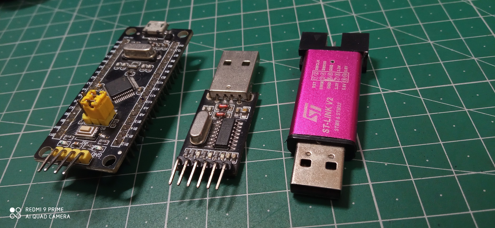

# STM32-F103-C6-Examples

### all programs here has been made in STM 32 CUBE IDE

## Components used:-
 1. STM32 F103 C6 development board - (black pill)
 2. ST Link V2 Programmer
 3. CH 340 USB to TTL interface module

  

  
